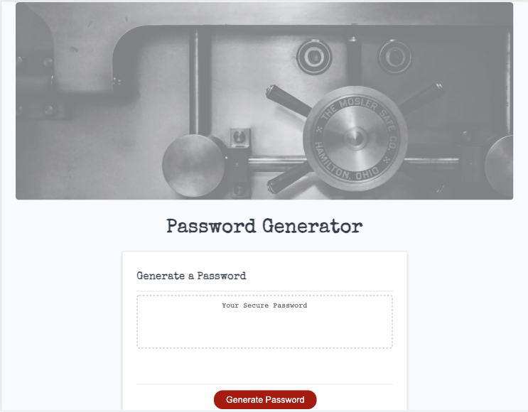
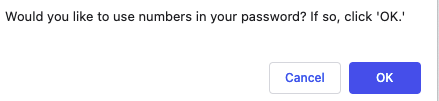

# Password_Generator

## Description

- What was my motivation? I needed to modify starter code to create an application that enables employees to generate random passwords based on criteria that they've selected.
- Why did I build this project? I built this project to better understand how JavaScript code dynamically updates its HTML and CSS files.
- What problem does it solve? This project resolves the unresponsive nature of the webpage through the use of JavaScript.
- What did I learn? I learned about arrays, "if" statements, "for" loops, variables, and many other keywords used within JavaScript.

## Table of Contents

- [Installation](#installation)
- [Usage](#usage)
- [Credits](#credits)
- [License](#license)
- [Links](#links)

## Installation

Although this is simply a webpage and no installation is necessary, there were certain criteria that had to be met in order to complete this project:

    User Story

    AS AN employee with access to sensitive data
    I WANT to randomly generate a password that meets certain criteria
    SO THAT I can create a strong password that provides greater security

    Acceptance Criteria

    GIVEN I need a new, secure password
    WHEN I click the button to generate a password
    THEN I am presented with a series of prompts for password criteria
    WHEN prompted for password criteria
    THEN I select which criteria to include in the password
    WHEN prompted for the length of the password
    THEN I choose a length of at least 8 characters and no more than 128 characters
    WHEN asked for character types to include in the password
    THEN I confirm whether or not to include lowercase, uppercase, numeric, and/or special characters
    WHEN I answer each prompt
    THEN my input should be validated and at least one character type should be selected
    WHEN all prompts are answered
    THEN a password is generated that matches the selected criteria
    WHEN the password is generated
    THEN the password is either displayed in an alert or written to the page

### Mock-Up

The following image shows the web application's appearance and functionality:

## Usage
Please see below for examples of this webpage, which demonstrate its functionality:

### Initial View

###  Initial Prompt

###  *Alert triggered if input is left empty, "Cancel" is selected, or a number outside the required range is entered. 

###  First Option: Numeric Characters 

###  Second Option: Special Characters

###  Third Option: Lowercase Letters

###  Fourth Option: Uppercase Letters

###  Example Password

###  *Alert triggered if "Cancel" is selected on all options.

## Credits
- https://javascript.info/
- https://du.bootcampcontent.com/denver-coding-bootcamp/du-den-virt-fsf-pt-08-2021-u-c/-/tree/master/03-JavaScript/02-Homework
- https://coding-boot-camp.github.io/full-stack/github/professional-readme-guide

## License
© 2021 Trilogy Education Services, LLC, a 2U, Inc. brand. Confidential and Proprietary. All Rights Reserved.

## Links
[Live Link](https://carlincb.github.io/Password_Generator/)

[GitHub Link](https://github.com/carlincb/Password_Generator)
